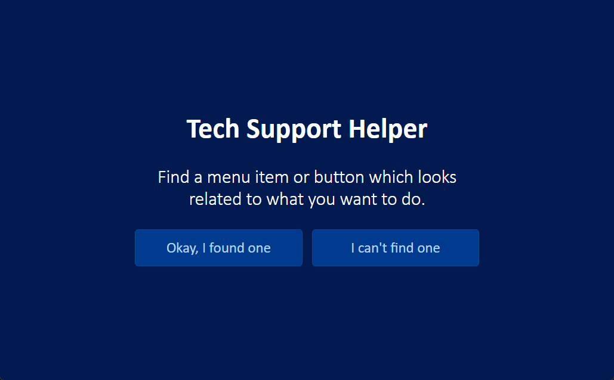

# Tech Support Helper

(formerly called Tech Support Cheat Sheet)¹

Dear various parents, grandparents, co-workers, and other ‘not computer people’.

Tech Support Helper is a simple, interactive web app that guides users through troubleshooting technical issues step-by-step.

It’s like having that “IT person” with you who gently steers you toward the light at the end of the technical tunnel.

[schalkburger.io/projects/tech-support-helper](https://schalkburger.io/projects/tech-support-helper)

---

¹ https://www.explainxkcd.com/wiki/index.php/627:_Tech_Support_Cheat_Sheet
